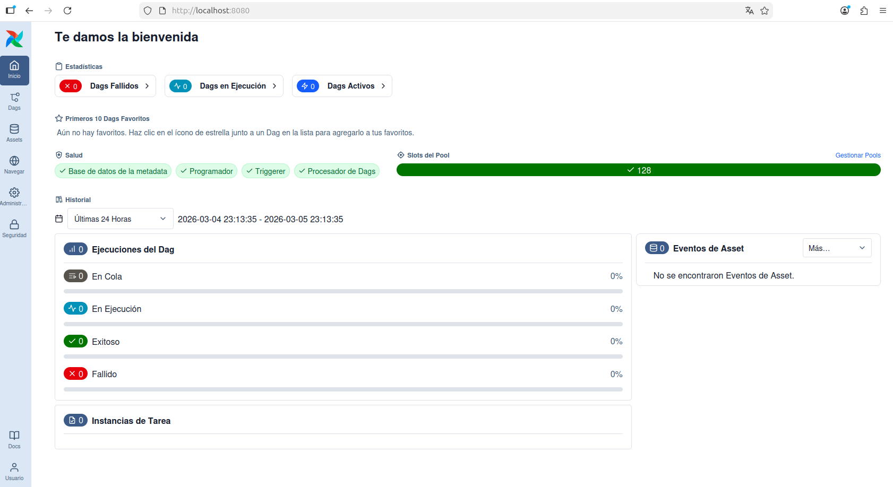
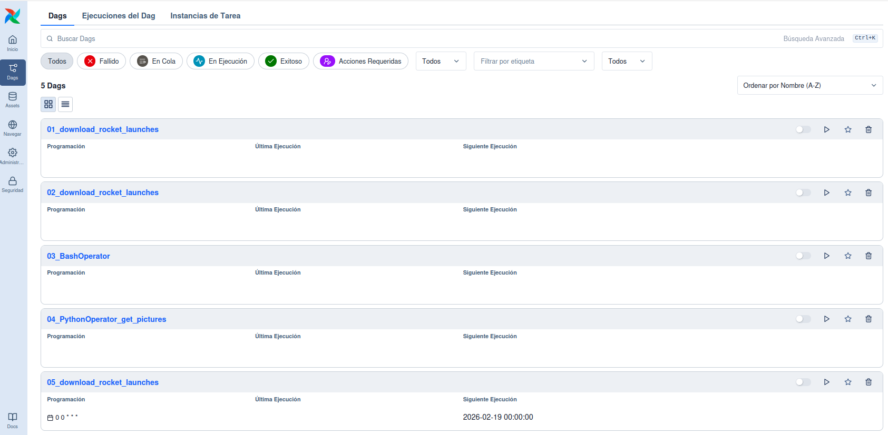
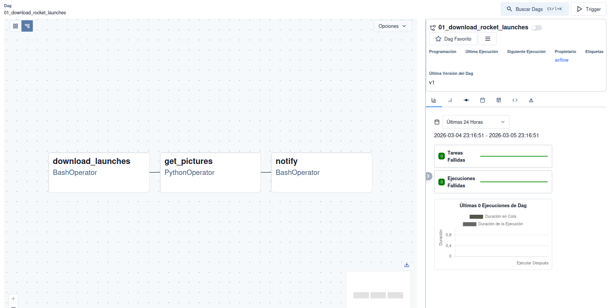

# Apache Airflow

Apache Airflow es una herramienta completa y potente para creación y gestión
de *pipelines* de procesamiento de datos en Python. Soporta tareas escritas
en otros lenguajes y está preparada para escalabilidad.

A continuación presentamos algunos ejemplos para ilustrar la nueva interfaz
web de gestión de DAGs incluida en Airflow 3.0. Los ejemplos están tomados
del repositorio de GitHub que acompaña a un libro de referencia actualizado
sobre este software de orquestación de procesos [@deRuiter2026].

## Estructura de un DAG en Airflow

## La interfaz web de usuario

La interfaz web de Airflow permite visualizar y gestionar los DAGs que se han definido en el sistema. Desde esta interfaz se pueden activar o desactivar DAGs, ejecutar tareas manualmente, revisar el estado de las ejecuciones y acceder a los logs de cada tarea.

La @fig-airflow-webui-home muestra la página principal de la interfaz web de Airflow, donde se listan los DAGs disponibles y se pueden realizar diversas acciones sobre ellos.

{#fig-airflow-webui-home width=95%}

En la columna de la izquierda aparecen los botones principales que permiten acceder a diferentes secciones 
de la interfaz, como la vista de DAGs, la vista de tareas, los logs y la configuración del sistema. 
En la parte superior aparecen varias etiquetas que permiten filtrar los DAGs por su estado, como "Fallidos",
"En Ejecución", o "Activos" etc. Esta visión se completa en la parte central, donde se listan los DAGs disponibles con información sobre su estado, última ejecución, y acciones disponibles. En la parte central derecha se muestra
un listado de "Eventos de Asset", que pueden estar asociados a los DAGs o tareas, y que permiten un seguimiento detallado de los cambios y eventos relacionados con los activos gestionados por Airflow.

Si pulsamos sobre el botón "DAGs" en la columna de la izquierda, se accede a una vista más detallada de los DAGs disponibles, donde se pueden activar o desactivar, ejecutar manualmente, o revisar su historial de ejecuciones. Esta vista se muestra en la @fig-airflow-webui-dags.

{#fig-airflow-webui-dags width=95%}

Haciendo clic en el nombre de un DAG específico, se accede a una vista detallada de ese DAG, donde se pueden ver las tareas que lo componen, su estado actual, y realizar acciones específicas sobre cada tarea. Esta vista se muestra en la @fig-airflow-webui-dag-graph, incluyendo un gráfico de dependencias entre las tareas, un listado de las tareas con su estado actual, y opciones para ejecutar o revisar los logs de cada tarea.

{#fig-airflow-webui-dag-graph width=95%}

### Ejecución de tareas y seguimiento

## Ejecución de DAGs de ejemplo