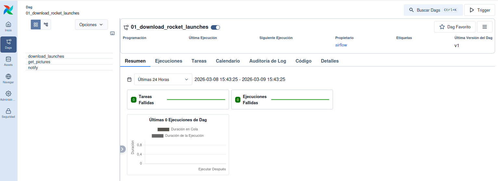
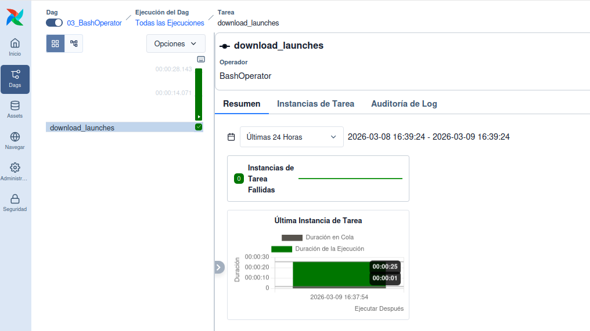
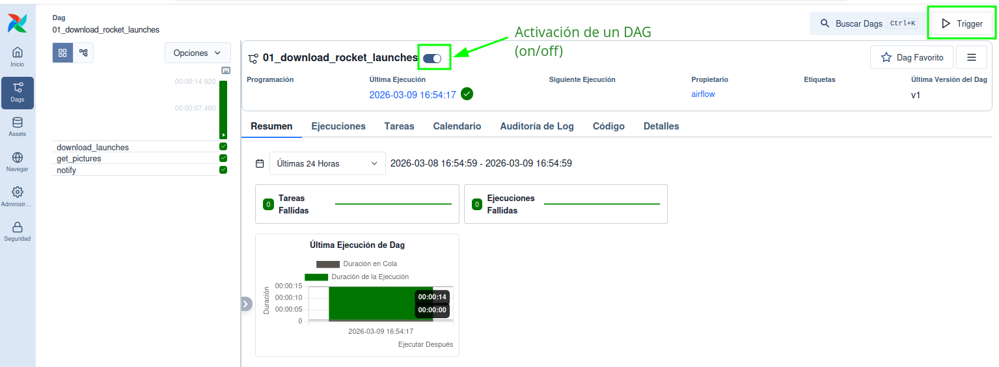
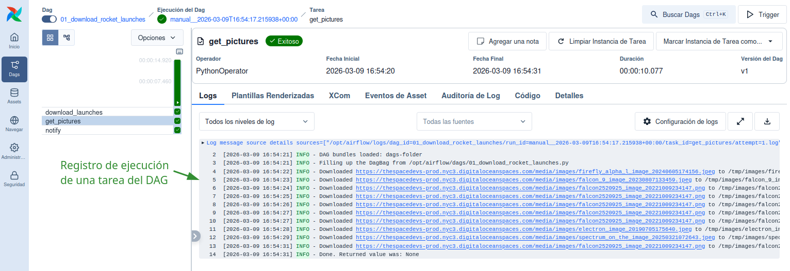

# Apache Airflow

Apache Airflow es una herramienta completa y potente para creación y gestión
de *pipelines* de procesamiento de datos en Python. Soporta tareas escritas
en otros lenguajes y está preparada para escalabilidad.

A continuación presentamos algunos ejemplos para ilustrar la nueva interfaz
web de gestión de DAGs incluida en Airflow 3.0. Los ejemplos están tomados
del repositorio de GitHub que acompaña a un libro de referencia actualizado
sobre este software de orquestación de procesos [@deRuiter2026].

## Estructura de un DAG en Airflow

## La interfaz web de usuario

La interfaz web de Airflow permite visualizar y gestionar los DAGs que se han definido en el sistema. Desde esta interfaz se pueden activar o desactivar DAGs, ejecutar tareas manualmente, revisar el estado de las ejecuciones y acceder a los logs de cada tarea.

La @fig-airflow-webui-home muestra la página principal de la interfaz web de Airflow, donde se listan los DAGs disponibles y se pueden realizar diversas acciones sobre ellos.

{#fig-airflow-webui-home width=95%}

En la columna de la izquierda aparecen los botones principales que permiten acceder a diferentes secciones 
de la interfaz, como la vista de DAGs, la vista de tareas, los logs y la configuración del sistema. 
En la parte superior aparecen varias etiquetas que permiten filtrar los DAGs por su estado, como "Fallidos",
"En Ejecución", o "Activos" etc. Esta visión se completa en la parte central, donde se listan los DAGs disponibles con información sobre su estado, última ejecución, y acciones disponibles. En la parte central derecha se muestra
un listado de "Eventos de Asset", que pueden estar asociados a los DAGs o tareas, y que permiten un seguimiento detallado de los cambios y eventos relacionados con los activos gestionados por Airflow.

Si pulsamos sobre el botón "DAGs" en la columna de la izquierda, se accede a una vista más detallada de los DAGs disponibles, donde se pueden activar o desactivar, ejecutar manualmente, o revisar su historial de ejecuciones. Esta vista se muestra en la @fig-airflow-webui-dags.

{#fig-airflow-webui-dags width=95%}

Haciendo clic en el nombre de un DAG específico, se accede a una vista detallada de ese DAG, donde se pueden ver las tareas que lo componen, su estado actual, y realizar acciones específicas sobre cada tarea. Esta vista se muestra en la @fig-airflow-webui-dag-graph, incluyendo un gráfico de dependencias entre las tareas, un listado de las tareas con su estado actual, y opciones para ejecutar o revisar los logs de cada tarea.

{#fig-airflow-webui-dag-graph width=95%}

Por otro lado, si pulsamos sobre la vista "Cuadrícula" la interfaz muestra una serie de pestañas que
proporcionan información sobre el DAG, incluyendo un resumen general, información sobre las ejecuciones
recientes, el listado de tareas incluidas en el DAG, el calendario de próximas ejecuciones programadas o
los archivos de registro (*logs*) asociados a cada tarea. Esta vista se muestra en la @fig-airflow-webui-dag-grid.

{#fig-airflow-webui-dag-grid width=95%}

## Ejecución de tareas y seguimiento

La interfaz web de Airflow también permite gestionar la ejecuión de tareas y DAGs, revisando el
estado en que se encuentran (en cola, en ejecución, finalizada con éxito, fallida, etc.), así como para
acceder a los logs de cada ejecución, facilitando la identificación de posibles errores o causas de fallos
en la ejecución de tareas. Además, la interfaz permite programar ejecuciones futuras de DAGs, configurar alertas y notificaciones, y gestionar los recursos del sistema para optimizar la ejecución de las tareas.

La @fig-airflow-webui-dag-task muestra la vista detallada de una tarea específica dentro de un DAG.

{#fig-airflow-webui-dag-task width=95%}

### Ejecución de DAGs de ejemplo

Cuando nos encontramos dentro de la vista detallada de un DAG, como se muestra en la 
@fig-airflow-webui-dag-activate podemos activar o desactivar el DAG mediante un botón deslizador ubicado
cerca de su nombre. Al activar el DAG, este comenzará a ejecutarse según la programación definida en su configuración, y se podrán visualizar las ejecuciones en tiempo real a través de la interfaz web.
Además, también se puede ejecutar el DAG manualmente, para lo que podemos pulsar el botón "Trigger"
situado en la parte superior derecha de la interfaz, lo que iniciará una ejecución inmediata del DAG, independientemente de su programación regular. Esta funcionalidad es útil para pruebas o para ejecutar tareas de forma ad-hoc.

{#fig-airflow-webui-dag-activate width=95%}

Una vez concluida la ejecución de un DAG, se puede revisar el estado de cada tarea y acceder a los logs para verificar que todo se ha ejecutado correctamente o para identificar posibles errores. La @fig-airflow-webui-dag-task-exec-log muestra la vista de logs de una tarea específica, donde se pueden revisar los mensajes generados durante su ejecución.

{#fig-airflow-webui-dag-task-exec-log width=95%}