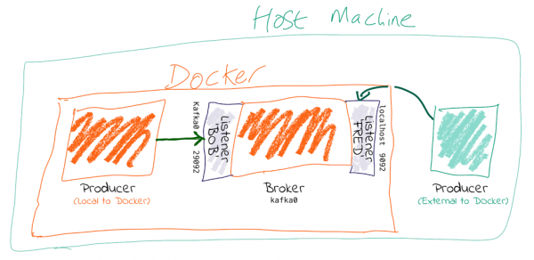

# Apache Kafka

Kafka es un sistema escalable para colas de mensajes de gran envergadura. Soporta
particionado de datos, alta disponibilidad y replicabilidad, garantizando un caudal
de datos (*throughput*) elevado y sostenido.

La @fig-kafka-overview muestra un ejemplo típico de utilización de Kafka, que
proporciona un sistema base de transmisión de datos entre muchos otros componentes de la
infraestructura de ingeniería de datos de una organización.

![La función típica de Kafka es situarse como autopista de transferencia de datos entre diferentes componentes de un sistema distribuido de procesamiento de datos. Fuente: [@Shapira2021].](figs/kafka-overview.png){#fig-kafka-overview width=80%}


## Instalación (imagen Docker)

::: {.callout-note}
## Documentación
*Imagen oficial* `docker.io/apache/kafka`: <https://hub.docker.com/r/apache/kafka>.
:::

La **imagen oficial ** para instalar Apache Kafka con Docker es: 

- <https://hub.docker.com/r/apache/kafka>.

Existen también otras imágenes alternativas:

- `docker.io/bitnami/kafka`: Otra imagen para generar contenedores con Kafka muy conocida y con gran cantidad de opciones
de configuración. Su documentación en DockerHub también es muy completa, aclarando aspectos importanes para configurar nuestro contenedor
con parámetros y valores no estándar.

    - <https://hub.docker.com/r/bitnami/kafka>.

- `docker.io/ubuntu/kafka`: La imagen de Kafka oficial de Ubuntu, en caso de que se necesite instalar la misma versión que en este sabor de Linux.

    - <https://hub.docker.com/r/ubuntu/kafka>.

Para crear un contenedor Docker que utilice la imagen oficial de Apache Kafka utilizando
Podman (véase @sec-podman), primer descargamos la imagen:

```bash
$ podman pull docker.io/apache/kafka:latest
```

Después, creamos y ponemos en marcha un contenedor que exponga los puertos necesarios para
poder acceder al clúster de Kafka desde fuera de dicho contenedor.

```bash
$ podman run -dt -p 9092:9092 --name kafka apache/kafka:latest
```

## Configuración por defecto

::: {.callout-note}
## Documentación
*Kafka Listeners Explained*: <https://www.confluent.io/blog/kafka-listeners-explained/>.

*Kafka: The Definitive Guide*, capítulo 2: <https://learning.oreilly.com/library/view/kafka-the-definitive/9781492043072/ch02.html>.
:::

La configuración por defecto de Kafka utiliza dos puertos de nuestra máquina/contenedor.

- El ***listener*** es el servicio que gestiona las peticiones de conexión de los clientes
al clúster de Kafka. Por defecto usa el puerto `9092`.
- El **controlador** es un servicio que gestiona el estado de las particiones y réplicas
del clúster de Kafka. Por defecto usa el puerto `9093`.

La @fig-kafka-host-docker muestra la utilización del puerto 9092 para aceptar las peticiones
de los clientes (tanto productores como consumidores). El puerto 9093 es interno y queda
reservado para tareas del plano de gestión.


{#fig-kafka-host-docker width=90%}


## Configuraciones específicas

::: {.callout-note}
## Documentación
*Kafka Listeners Explained* (Confluet website): <https://www.confluent.io/blog/kafka-listeners-explained/>.

*Troubleshooting connections to Apache Kafka Cluster*, capítulo 2: <https://www.confluent.io/blog/kafka-client-cannot-connect-to-broker-on-aws-on-docker-etc/>.
:::

Si necesitamos cambiar los puertos que utiliza nuestro contenedor de Kafka debemos poner mucho cuidado
en editar todos los parámetros necesarios.

Lo más conveniente es crear un archivo `docker-compose.yml` que contenga los valores de configuración de todas
las variables implicadas, para evitar ejecutar comandos de varias líneas en la terminal. Una vez preparado,
podemos usar el programa `podman-compose` (que hay que instalar aparte, con APT o similar) 
para que interprete este archivo de configuración en [formato estandarizado](https://www.compose-spec.io/) 
y levante nuestro contenedor.

Veamos un archivo de ejemplo `docker-compose.yml` para ejecutar nuestro contenedor, de forma 
que escuche peticiones de clientes en el puerto `9094` y emplee el puerto `9095` para tareas de control.

```yaml

```

Por último, ejecutamos el contenedor exponiendo el puerto correspondiente con los datos que hemos incluido
en el archivo de configuración.

```
$ podman-compose -f docker-compose.yml up -d
```

::: {.callout-warning}
## Entendiendo el funcionamiento del *listener*
Hay que prestar atención en la configuración para modificar correctamente todos los parámetros que ajustan
los puertos utilizados por Kafka.

En particular, un parámetro de configuración *crítico* es `KAFKA_ADVERTISED_LISTENERS`. Por ejemplo, si olvidamos
cambiar su valor de configuració y se queda apuntando a otro sitio, como `localhost:9092`:

```yaml
KAFKA_ADVERTISED_LISTENERS: PLAINTEXT://localhost:9092
```

Se producirán errores no evidentes, ya que alcanzaremos correctamente el *listener* de nuestro clúster pero este
informará a los clientes de que deben conectarse a `localhost:9092` para interaccionar con el *broker* de Kafka.

En resumen, hay que prestar atención y repasar bien el contenido de todos los parámetros que involucren
configuración de puertos en el fichero `docker-compose.yml`.
:::


## Ejecución de clientes en el contenedor

**Acceso a una terminal dentro del contenedor**

```bash
$ podman exec --workdir /opt/kafka/bin/ -it kafka sh
```

**Creación de un nuevo *topic* **

Este paso no es estrictamente necesario, puesto que la mayoría de las librerías/paquetes para desarrollar
productores con Kafka crean automáticamente el *topic* nuevo en caso de que no exista previamente antes de
enviar los datos.

```bash
/opt/kafka/bin $ ./kafka-topics.sh --bootstrap-server localhost:9092 --create --topic test-topic
Created topic test-topic.
```

**Ejecución de un productor que inserta valores (se detiene con `<CTRL+C>`).

```bash
/opt/kafka/bin $ ./kafka-console-producer.sh --bootstrap-server localhost:9092 --topic test-topic
>hello
>world
>yikes!
>^C/opt/kafka/bin $ 
```
**Ejecución de un productor que inserta parejas *clave:valor* **

```bash
./kafka-console-producer.sh --bootstrap-server localhost:9092 --topic test-topic --property
 "parse.key=true" --property "key.separator=:"
>key1:value1
>key2:value2
>key3:value3
>^C/opt/kafka/bin $  
```

**Ejecución dde un consumidor**

```bash
/opt/kafka/bin $ ./kafka-console-consumer.sh --bootstrap-server localhost:9092 --topic test-topic --from-beginning
hello
world
yikes!
^CProcessed a total of 3 messages
/opt/kafka/bin $
```

## Paquetes para desarrollo de clientes

### Python

- Paquete oficial de Confluent.
    - <https://docs.confluent.io/kafka-clients/python/current/overview.html>.

- Paquete alternativo.
    - <https://pypi.org/project/kafka-python/>.

## Referencias adicionales

### Documentación oficial de Confluent

Confluent es la empresa fundada por los creadores originales de Apache Kafka.

- Fundamentos de la arquitectura de Kafka: <https://developer.confluent.io/courses/architecture/get-started/>.
- Protocolo de replicación (particiones): <https://developer.confluent.io/courses/architecture/data-replication/>.
- El nuevo plano de control de Kafka: <https://developer.confluent.io/courses/architecture/control-plane/>.
    - KRaft ha sustituido al componente externo Zookeeper, que se utilizaba antes para gestión
    del plano de control de los clusters/brokers de Kafka.
- Protocolo de grupos de consumo: <https://developer.confluent.io/courses/architecture/consumer-group-protocol/>.